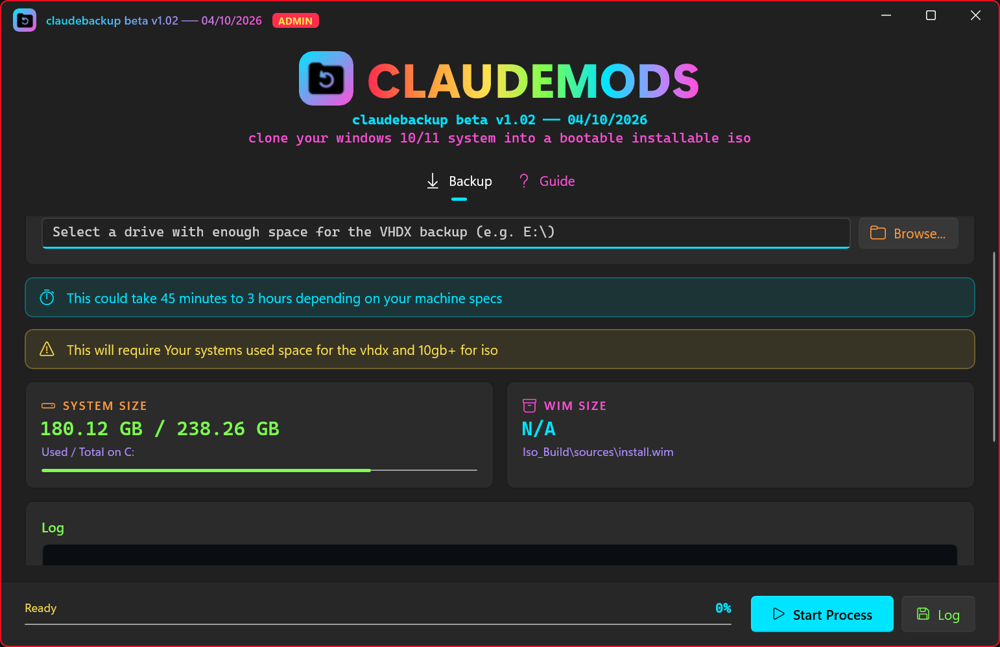

<div align="center">

# CLAUDEMODS · claudebackup

**Clone your Windows 10/11 system into a bootable, installable ISO.**




</div>

---

## What it does

claudebackup takes a full backup of your `C:` drive and turns it into an ISO you can boot and install from, so you can restore your exact system (apps, settings and files) onto the same or another PC.

1. **Backup**: creates a VHDX image of your system drive in a location you choose.
2. **Capture**: mounts the VHDX and compresses it into `install.wim`.
3. **Build ISO**: packs everything into a bootable `windowsbackup-<date>_<time>.iso` (BIOS + UEFI).

## Features

- Modern WinUI 3 interface with a dark neon theme
- Live progress bar driven by each step's real progress
- Shows your system's used/total size and the WIM size as it grows
- Full log of every step, saved to `log.txt`
- Built-in guide tab
- One-click installer

## Requirements

| | |
|---|---|
| **OS** | Windows 10 (1809+) or Windows 11, 64-bit |
| **Rights** | Administrator (the app asks for it on launch) |
| **Windows ADK** | [Windows ADK](https://learn.microsoft.com/windows-hardware/get-started/adk-install) with **Deployment Tools** selected (used to build the ISO) |
| **Disk space** | Your system's used space for the VHDX, plus **10 GB+** for the ISO |
| **Time** | Roughly **45 minutes to 3 hours**, depending on your machine |

## Installation

1. Download `claudebackup-setup-v1.02.exe` from [Releases](../../releases).
2. Run it and follow the setup wizard (default location: `C:\claudebackup`).
3. If the Windows ADK Deployment Tools aren't installed, setup will remind you. Install them before running a backup.

## How to use

1. Launch **claudebackup** and click **Yes** on the admin prompt.
2. Click **Browse...** and select a drive with enough space for the VHDX backup.
3. Click **Start Process** and leave it running.
4. When it's done, the ISO is saved in the claudebackup install folder.
5. Boot from the ISO (e.g. write it to a USB stick with [Rufus](https://rufus.ie)) and use the **old Windows installer** to install your cloned system.

> [!TIP]
> Click **Log** at any time to save the current log to `log.txt` in the install folder. It's also saved automatically when a run finishes or fails.

## Install folder layout

```
C:\claudebackup\
├── claudebackup.exe
├── Iso_Build\                          ISO contents (install.wim is written to sources\)
├── wimlib-1.14.5-windows-x86_64-bin\   WIM capture tool
├── windowsbackup-<date>_<time>.iso     your backups
└── log.txt
```

## Uninstalling

Use **Settings → Apps → Installed apps → claudebackup → Uninstall**. The app, `log.txt` and any leftover `install.wim` are removed. **ISOs you created are kept.**

## Credits

- [wimlib](https://wimlib.net): WIM capture (licensed separately under GPLv3/LGPLv3)
- Windows Server Backup (`wbadmin`) and the Windows ADK, by Microsoft
- Built with [WinUI 3 / Windows App SDK](https://learn.microsoft.com/windows/apps/winui/winui3/)

## Disclaimer

This is beta software. Always keep a separate backup of important data. You are responsible for complying with Windows licensing when installing a cloned system on another PC.

---

<div align="center">

**CLAUDEMODS** · claudebackup beta v1.02 · 04/10/2026

</div>
